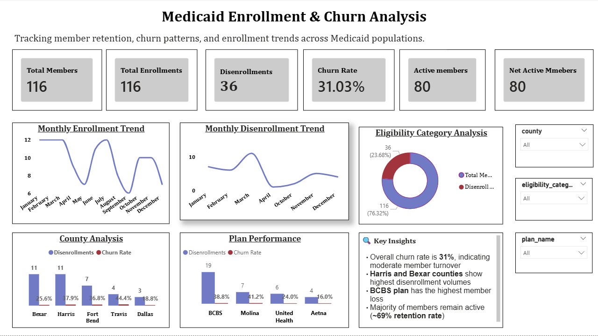

Medicaid Enrollment & Churn Analysis Dashboard

Overview

This project analyzes Medicaid member enrollment and disenrollment trends to identify churn patterns, high-risk populations, and opportunities for improving retention strategies.

Objectives

Track enrollment and disenrollment trends
Calculate churn rate and retention metrics
Identify high-risk counties and health plans
Provide actionable insights

Tools Used

- SQL
- Power BI
- Excel

Key Features

- KPI Dashboard (Total Members, Churn Rate, Active Members)
- Monthly Enrollment & Disenrollment Trends
- County & Plan Analysis
- Interactive Filters

Key Insights

- Overall churn rate is 31%, indicating moderate turnover
- Harris and Bexar counties show highest disenrollment
- BCBS plan has highest member loss
- 69% members remain active

Dashboard Preview

