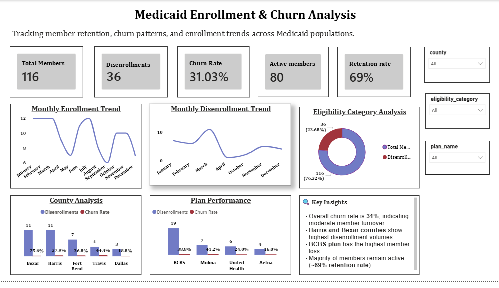

Medicaid Enrollment & Churn Analysis Dashboard

## Overview
This project analyzes Medicaid member enrollment and disenrollment trends to identify churn patterns, high-risk populations, and opportunities for improving retention strategies. This analysis helps healthcare organizations improve member retention, reduce churn, and optimize operational efficiency.

## Objectives
- Track enrollment and disenrollment trends
- Calculate churn rate and retention metrics
- Identify high-risk counties and health plans
- Provide actionable insights

## Dataset
This project uses simulated Medicaid data with the following tables:

- **members**: member_id, age, gender, county, plan_name
- **enrollment_history**: enrollment_date, disenrollment_date, status
These tables were joined using member_id to analyze enrollment patterns and churn behavior. The data model follows a one-to-many relationship where a single member can have multiple enrollment records over time.
## Key Metrics (KPIs)

- **Churn Rate** = Members Disenrolled / Total Members
- **Active Members** = Members with active enrollment status
- **Disenrollment Rate** = Members disenrolled / Total Members in a given period
- **Retention Rate** = Active Members / Total Members 

## Approach
- Created relational tables using SQL
- Generated sample enrollment and member data
- Wrote SQL queries to calculate KPIs such as churn rate, disenrollment rate, and active members
- Imported data into Power BI and built data model
- Designed dashboard with filters for county, plan, and eligibility category
  
## Key Features
- KPI Dashboard (Total Members, Churn Rate, Active Members, Retention Rate)
- Monthly Enrollment & Disenrollment Trends
- County & Plan Analysis
- Interactive Filters

## Key Insights
- Overall churn rate is **31%**, indicating moderate member turnover
- Harris and Bexar counties show the highest disenrollment, suggesting potential retention issues in these regions
- BCBS plan has the highest member loss, indicating plan-level churn concentration
- Re-enrollment patterns suggest gaps in continuous coverage, leading to administrative inefficiencies
- Retention rate of **~69%** indicates relatively stable membership, but also highlights opportunities to improve retention and reduce churn
- These insights suggest focusing retention strategies on high-churn counties and plans, and improving continuity of coverage to reduce re-enrollment gaps.
- These findings can help healthcare organizations prioritize retention strategies, optimize plan performance, and reduce administrative costs associated with member churn.

## Tools
- SQL (MySQL/PostgreSQL)
- Power BI (Data Modeling, DAX, Dashboarding)
- Excel (Data Cleaning, Analysis)

## How to Use
- Run SQL scripts in the SQL folder to create tables and data
- Open Power BI file from the PowerBI folder
- Explore dashboard using filters (county, plan, eligibility)

## Project Structure
- SQL/
  - create_tables.sql
  - analysis_queries.sql
- PowerBI/
  - medicaid_enrollment_churn_dashboard.pbix
- Images/
  - Dashboard.png
  - KPI.png

## Dashboard Preview

